# DIAGRAMS.md — VoxelsEngine Process & Flow Reference

> Companion to [ARCHITECTURE.md](ARCHITECTURE.md). These diagrams are the canonical description of *how the game runs*. Agents must read the relevant diagram before touching a subsystem, and must update the diagram in the same commit if a work item changes a flow.
>
> Legend: boxes are runtime components. "test-only" marks a path reachable solely from tests or `--headless`; "unimplemented" marks a declared but intentionally unbuilt backend.

---

## 1. System Layering & Dependency Direction

Dependencies flow strictly downward. An arrow means "may include / may call".

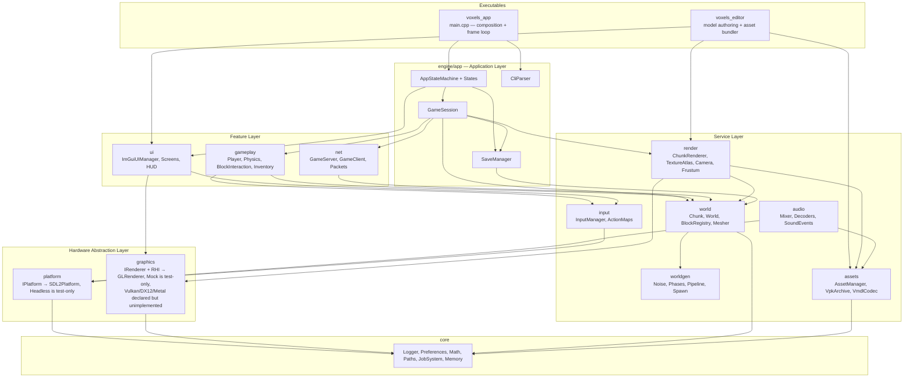

**Forbidden edges:** `world → graphics`, `worldgen → render`, `core → anything`. The mesher emits plain vertex data; only `render` knows about GPU buffers.

---

## 2. Boot & Shutdown Sequence

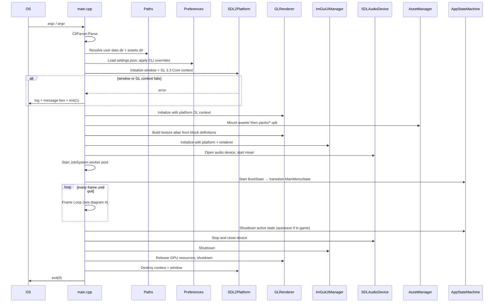

---

## 3. Application State Machine

Each state owns a full-screen UI and its own update/render behavior. No state is an empty class.

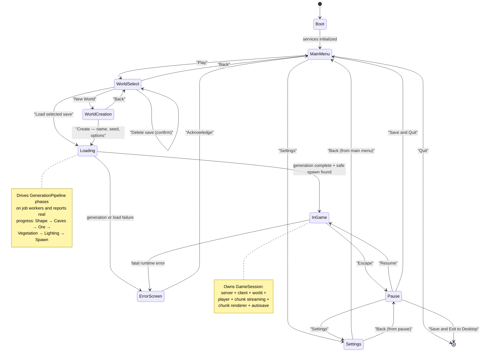

---

## 4. Frame Loop — Fixed Simulation, Variable Render

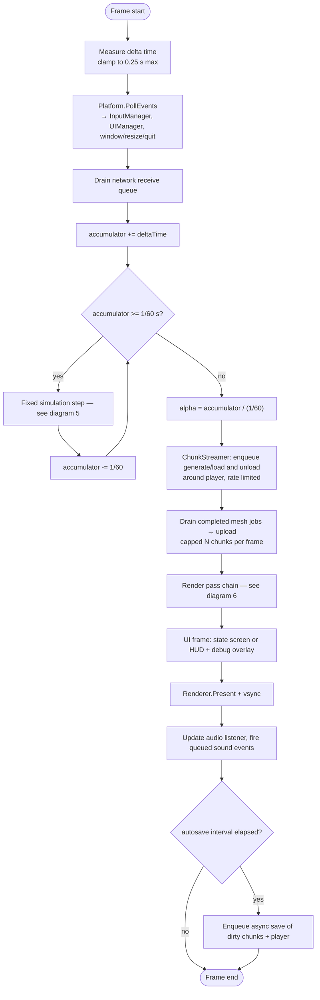

`maxTicks` bounded loops are a **test-only** affordance behind `--headless`; the shipped app runs until the player quits.

---

## 5. Fixed Simulation Step (in-game)

```mermaid
sequenceDiagram
    participant Inp as InputManager
    participant Cam as CameraController
    participant Cli as GameClient
    participant Srv as GameServer
    participant Phy as PhysicsSystem
    participant BI as BlockInteraction
    participant W as World
    participant CR as ChunkRenderer
    participant Snd as AudioMixer

    Inp->>Cam: mouse delta → yaw / pitch
    Inp->>Cli: action states → PlayerIntent {move, jump, sneak, break, place, hotbar}
    Cli->>Srv: C2S_Input (sequence numbered)
    Cli->>Phy: predict locally with same intent

    Srv->>Phy: apply intent → velocity
    Phy->>Phy: gravity, drag, jump impulse
    Phy->>W: query solid AABBs in swept region
    Phy->>Phy: resolve per axis X, Z, Y; set onGround
    Srv->>BI: if break/place requested
    BI->>W: DDA raycast from eye, max 5 blocks
    alt hit and cooldown elapsed
        BI->>W: SetBlock (break → Air, place → held block)
        W->>W: refresh edited skylight column across resident sections
        W->>CR: mark edited chunk and touched boundaries dirty
        W->>Snd: queue block break/place sound event
        Srv->>Cli: S2C_BlockEdit broadcast
    end
    Srv->>Cli: S2C_EntityState (authoritative transform)
    Cli->>Cli: reconcile prediction against authoritative state
    Phy->>Snd: footstep event on ground-contact cadence
```

---

## 6. Render Pipeline (one frame)

```mermaid
flowchart LR
    BEGIN["Renderer.BeginFrame<br/>clear color + depth"] --> CAMU["Update camera matrices<br/>view, projection, interpolated eye"]
    CAMU --> FRUS["Build frustum, cull chunk meshes"]
    FRUS --> OPAQUE["Pass 1: opaque chunk meshes<br/>atlas texture, depth write on"]
    OPAQUE --> MODELS["Pass 2: sub-voxel models + entities<br/>.vmdl instances, players"]
    MODELS --> WATER["Pass 3: transparent<br/>water, leaves, glass — sorted back to front, depth write off"]
    WATER --> DEBUG["Pass 4: debug lines<br/>targeted block outline, chunk bounds if enabled"]
    DEBUG --> HUD["Pass 5: HUD primitives<br/>crosshair, hotbar, held item"]
    HUD --> IMGUI["Pass 6: ImGui draw data<br/>menus, settings, F3 overlay"]
    IMGUI --> PRES["Renderer.EndFrame → Present"]
```

**Chunk mesh path (data only reaches the GPU here):**

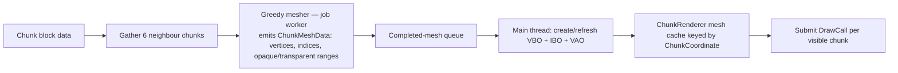

---

## 7. Chunk Lifecycle

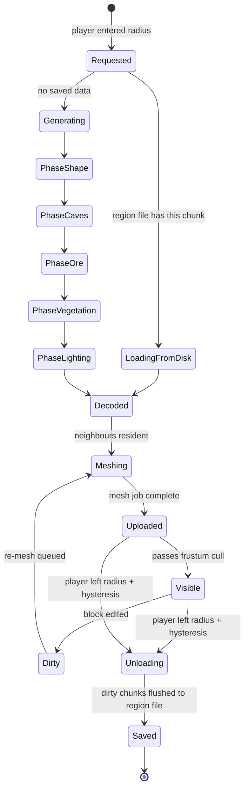

Hysteresis: load radius = render distance, unload radius = render distance + 2, so a player standing on a boundary does not thrash.

---

## 8. World Generation Pipeline

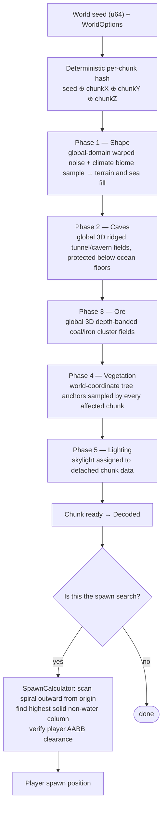

**Determinism contract:** running the pipeline twice with the same seed and chunk coordinate must produce byte-identical chunk data, regardless of thread count or generation order. Worker jobs return detached chunks; only the main thread inserts ready chunks into `World`. This is enforced by automated test.

---

## 9. Input Flow

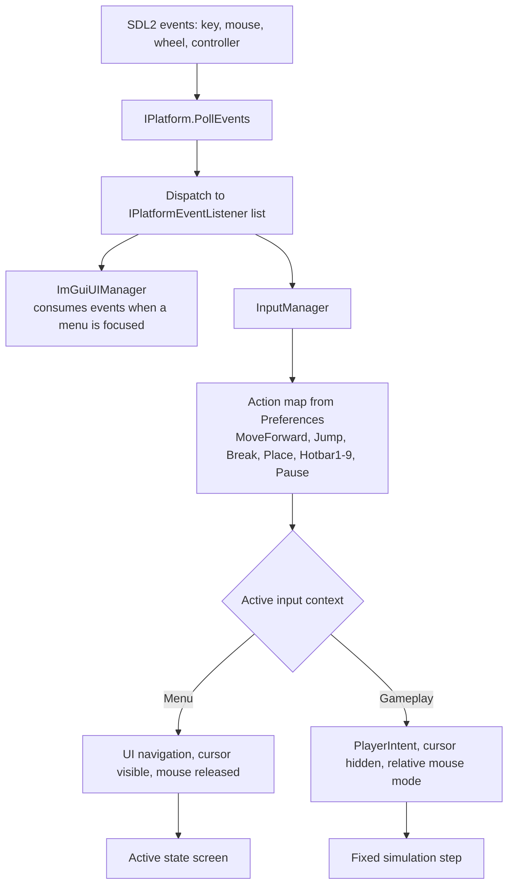

Mouse capture is owned by the state machine: `InGame` enters relative-mouse mode on entry and releases it on exit or focus loss. Alt-Tab must never leave the cursor trapped.

---

## 10. Persistence Flow

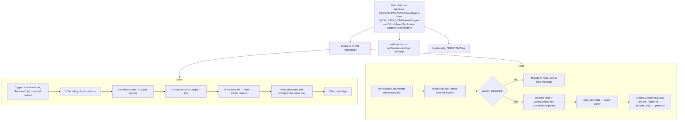

---

## 11. Content Pipeline — Editor to Game

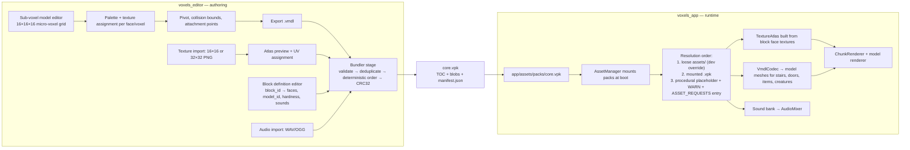

**Association rule:** a block type gains custom geometry purely through data — `blocks.json` sets `model_id`, and the runtime looks up the `.vmdl` in the mounted pack. No code change is required to add a block shape.

---

## 12. Client / Server Topology

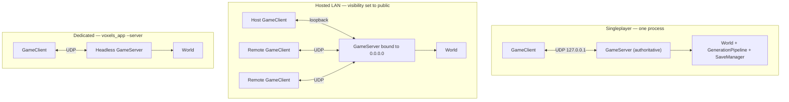

Packet flow per connection:

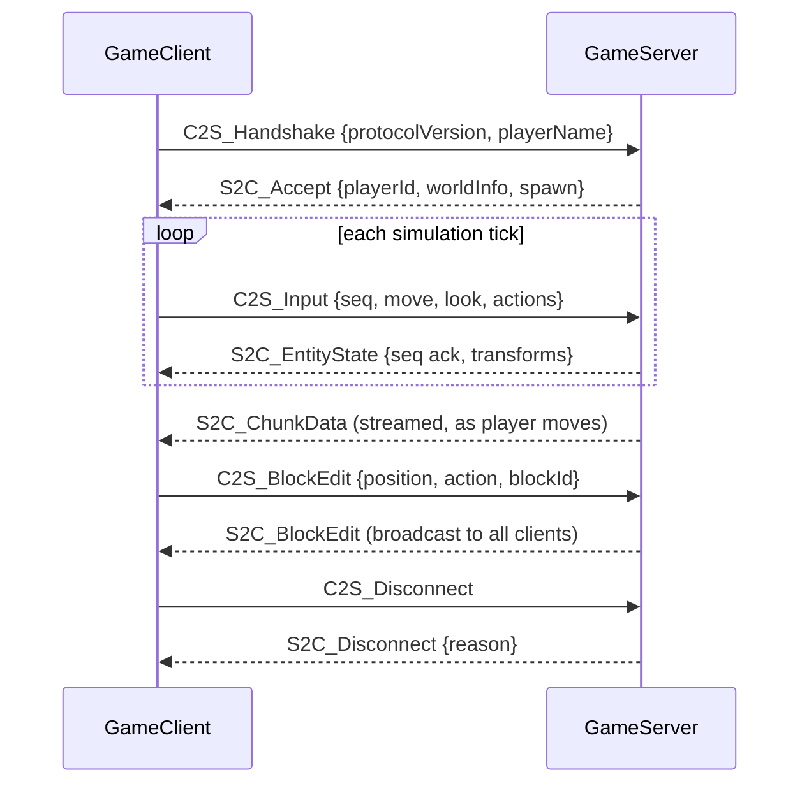

---

## 13. Audio Flow

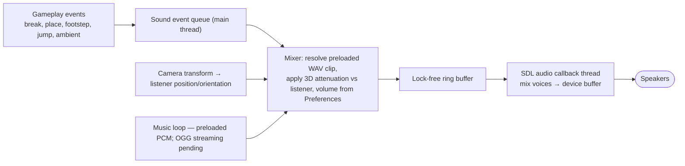

The audio callback never allocates, never locks, and never touches game state directly.
