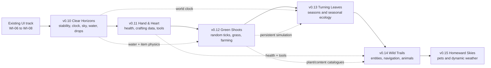
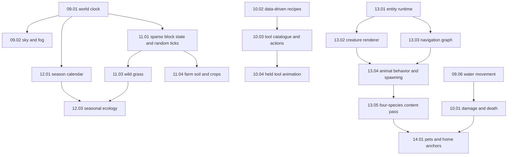

# VoxelsEngine Product Health and Delivery Roadmap

> **Status:** Portfolio-level delivery plan, based on the code and human playtest report audited on
> 2026-09-10. [ARCHITECTURE.md](ARCHITECTURE.md) remains authoritative for runtime contracts, and
> [work_items/README.md](work_items/README.md) remains the detailed web-UI migration track.

## Product Health Snapshot

The project has a credible playable foundation: a real SDL/OpenGL desktop path, generated and
streamed terrain, persistence, networking, audio, CEF player UI, block interaction, crafting,
inventory manipulation, and dropped-item entities. The repository contains roughly 82,000 lines
of C/C++, 214 registered CTest cases, and only four `TODO`/`FIXME`/`HACK` markers. Development is
active, with 154 commits in the 30 days preceding this audit.

The principal risk is no longer missing platform scaffolding. It is **feature growth concentrating
inside application-state orchestration without shared simulation foundations**. Recipes, HUD
publication, world time, and several gameplay bridges currently converge in
`engine/src/app/state_machine_render.cpp`. Animals, seasons, farming, health, and tools must not
add separate clocks, entity loops, recipe tables, or ad hoc persistence there.

### Health Scorecard

| Area | Health | Evidence | Roadmap response |
| --- | --- | --- | --- |
| Desktop runtime/rendering | Strong | Real SDL2 + OpenGL 3.3 path; chunk meshes reach the GPU | Preserve the shipping path and add atmosphere/entity passes incrementally |
| Automated verification | Strong, incomplete at feature edges | 214 registered tests; meaningful world, interaction, persistence, UI, and drop tests | Add visual, audio-transition, random-tick, navigation, and composed-runtime tests |
| Player UI | Functional migration in progress | CEF HUD/inventory/crafting is live; WI-07 and WI-08 hardening remain open | Reconcile WI-06 evidence, then finish WI-07 and WI-08 before calling UI complete |
| Gameplay simulation | Moderate | Movement, collision, breaking/placing, inventory, and drops work | Add one world clock, damage authority, random ticks, and entity runtime |
| Content architecture | At risk | Blocks are data-driven; recipes are still a C++ table; item visuals are placeholders | Move recipes/tools/plants/animals to validated data catalogues |
| Persistence/networking | Moderate | Player/chunk save and block replication exist | Version all new world/entity state and define authority before feature integration |
| Performance observability | Moderate | Chunk metrics and fixed-step loop exist | Add budgets for ticks, entities, pathfinding, UI publication, and draw submissions |
| Frontend dependency hygiene | At risk | Canonical build reports 3 npm audit findings: 1 moderate and 2 high | WI-07 must triage/remediate or explicitly accept each finding before release |
| Content fidelity | Early | Generated textures/audio/models make features visible but are placeholders | Register exact art/audio requests as each content-bearing item lands |

## Tester Report Triage

The playtest report is the product truth. The implementation audit refines each observation so the
roadmap fixes current behavior instead of reimplementing work that has already landed.

| Reported area | Audit result | Immediate interpretation |
| --- | --- | --- |
| Gray sky and short fog | Confirmed | Chunk fog is hard-coded from 24 to 72 blocks and blends geometry directly into the clear color; celestial colors exist but no persisted clock drives them |
| Five-heart health HUD | Missing player-facing behavior | Player health and save fields exist, but damage/death rules and heart rendering/customization do not |
| Animals | Missing | No general simulation entity, navigation, animal AI, procedural creature animation, or animal spawn/drop pipeline exists |
| Wild grass | Missing as vegetation | The current grass is a terrain cube; there is no billboard plant, growth state, random tick, or seed drop |
| Tools | Mostly missing | One tool recipe exists, but tools do not affect interaction speed and no held-tool render/swing system exists |
| Seasons | Missing | Celestial lighting math is reusable, but there is no persistent calendar, season transition, UI, or seasonal simulation |
| Farming | Missing | There is no plant-state storage, hydration, sunlight rule, spacing rule, growth, or harvest loop |
| Crafting layout and manipulation | Partially resolved after report | Slots now enforce square aspect ratio and pointer drag/drop is wired; recipes remain hard-coded, controller movement is only presented as a hint, and developer recipe authoring is undocumented |
| Dropped-item orange/back-face rendering | Confirmed root cause | Drops use an untextured hash-colored triangle cube in the HUD renderer, outside the material/atlas path; cull correctness has no GPU regression test |
| Dropped-item collision and magnetism | Confirmed | Simulation only probes the block below; it has no lateral/ceiling sweep and pickup is an abrupt radius test |
| Water spawn | Guard exists but field report remains valid | Spawn search rejects water and has a generation test, so a composed new-world regression or fallback path is still failing and must be captured before changing rules |
| Underwater placement | Confirmed | Placement only accepts `Air`; liquid cells are rejected even though targeting skips through liquid |
| Swimming and underwater visuals | Missing | Water is non-solid and emits splash events, but has no buoyancy, drag, swim input, oxygen, or camera-medium render state |
| Music overlap near track end | Confirmed architecture defect | The director controls category-wide gains but cannot stop or fade an individual mixer voice, so ownership and transition timing are not enforceable |

## Delivery Principles

1. **Fix observed defects before content multiplication.** Music overlap, item rendering/collision,
   water interaction, and fog are early work because they degrade every play session.
2. **Build shared simulation once.** One persistent world clock drives day/night, seasons, plants,
   weather, and spawn schedules. One random-tick service drives sparse block evolution. One entity
   runtime owns animals and future hostile actors.
3. **Use data catalogues for content families.** Recipes, tools, plants, drops, and animal species
   must be validated data, not switches or static tables in app states.
4. **Keep authority explicit.** World time, damage, growth, drops, and animal movement are
   server-authoritative. A single-player hosted server follows the same path.
5. **Prefer voxel navigation data over a baked triangle navmesh.** The world changes at runtime.
   A hierarchical walkable-surface graph with bounded local A* can invalidate by dirty chunk and
   later serve both passive and hostile actors.
6. **Every phase ends in the desktop application.** Unit tests establish deterministic contracts;
   non-headless smoke runs prove the player-visible result.

## Version Roadmap

| Version | Internal name | Player outcome | Detailed work items |
| --- | --- | --- | --- |
| v0.10 | **Clear Horizons** | Stable music, readable sky and distance, reliable drops, safe water interaction, swimming, and polished inventory foundations | [work_items/09_clear_horizons.md](work_items/09_clear_horizons.md) |
| v0.11 | **Hand & Heart** | Five-heart survival loop, configurable heart color, data-driven recipes, useful tools, and visible swings | [work_items/10_hand_and_heart.md](work_items/10_hand_and_heart.md) |
| v0.12 | **Green Shoots** | Wild grass grows and drops seeds; farm plots hydrate, crops grow by light/day, and harvests persist | [work_items/11_green_shoots.md](work_items/11_green_shoots.md) |
| v0.13 | **Turning Leaves** | A persistent 20-day seasonal cycle changes vegetation and appears in inventory | [work_items/12_turning_leaves.md](work_items/12_turning_leaves.md) |
| v0.14 | **Wild Trails** | Four performant animal species roam, navigate, flee, animate, vocalize, and drop configured resources | [work_items/13_wild_trails.md](work_items/13_wild_trails.md) |
| v0.15 | **Homeward Skies** | Pets can be named and return home safely; rain, snow, storms, and accumulation use the same world clock | [work_items/14_homeward_skies.md](work_items/14_homeward_skies.md) |

## Critical Path and Parallel Work

After `09.01`, rendering/audio fixes can proceed in parallel with recipe extraction because they
do not share controlling interfaces. Farming and seasons may share the clock contract but must not
edit the same persistence schema concurrently. Animal work starts only after health and sparse
simulation contracts stabilize; otherwise combat, drops, and lifecycle rules will be rewritten.

## Bottlenecks and Guardrails

| Bottleneck | Failure mode if ignored | Guardrail |
| --- | --- | --- |
| `state_machine_render.cpp` ownership growth | Merge conflicts, app-layer domain logic, untestable feature coupling | Extract catalogues and simulation services into `gameplay`, `world`, or `worldgen`; app states only coordinate and publish view models |
| Save/schema expansion | Seasons, crops, pets, and entities disappear or corrupt old worlds | Version migrations, atomic writes, malformed-input tests, and backward fixtures in every schema-changing item |
| Server-authority gap | Local-only growth/damage/animals diverge in multiplayer | Server owns time and mutations; clients receive snapshots/events and never authoritatively advance them |
| Dynamic-world navigation | Animals walk off cliffs or path through player edits | Chunk-local walk graph, clearance/support/hazard annotations, dirty-chunk invalidation, bounded search budgets |
| Entity CPU/draw scale | AI or one draw per animal consumes frame budget | Distance-tiered updates, spatial index, batched/instanced model parts, explicit 60 FPS budgets |
| Content explosion | Species/crops/tools become hard-coded branches | Strict JSON schemas, stable IDs, startup validation, developer authoring docs, fixture catalogues |
| Web/native interaction parity | Pointer works while controller/keyboard claims are cosmetic | Browser E2E and native dispatcher tests for every essential action; no hint is shown before its binding works |
| Audio voice ownership | Tracks overlap or category fades mute unrelated sounds | Mixer-issued voice handles with per-voice stop/fade and deterministic transition tests |

## Phase Exit Gates

Every version exits only when all of the following are true:

- Default `build/` configure and Debug build complete with zero project warnings.
- Full CTest is green; focused tests assert real state, pixels, audio envelopes, or persisted data.
- Frontend changes pass `npm --prefix ui run lint`, `npm --prefix ui run test`, and relevant E2E.
- A non-headless desktop run exercises each player-facing acceptance criterion; the operator closes
  the application after inspection.
- Frame-time, memory, queue, and entity budgets named by the work items are measured, not assumed.
- Runtime contracts update [ARCHITECTURE.md](ARCHITECTURE.md), [DIAGRAMS.md](DIAGRAMS.md), and
  [docs/PLAYER_UI_BRIDGE_API.md](docs/PLAYER_UI_BRIDGE_API.md) when applicable.
- Every placeholder asset is shipped in a usable form and registered in
  [ASSET_REQUESTS.md](ASSET_REQUESTS.md).
- Green checkpoints are committed and pushed using the repository workflow.

## Roadmap Hygiene Gate

Before declaring v0.10 complete, reconcile the existing WI-06 completion evidence and execute
WI-07/WI-08 or explicitly re-scope them. The code has advanced beyond parts of their prose, but
unchecked acceptance criteria are not proof. Record test counts, frontend/E2E results, soak data,
package evidence, and a real desktop observation in the corresponding files.

This gate does not block isolated v0.10 bug fixes. It blocks a version-complete claim and prevents
the roadmap from accumulating another set of optimistic documents detached from runtime evidence.