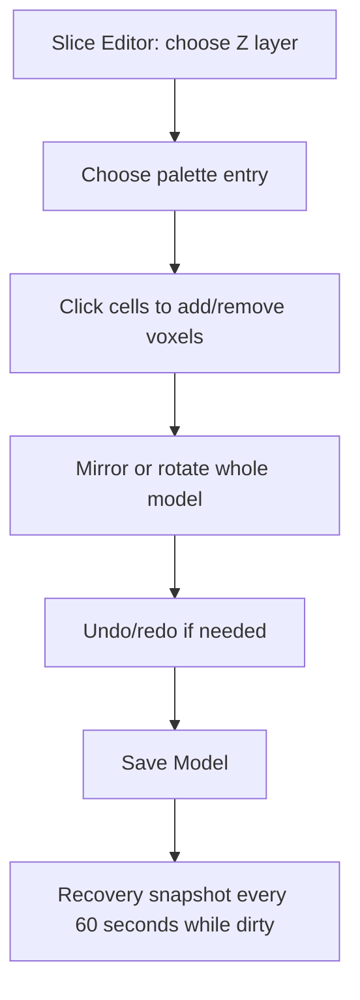

# Voxels Content Editor

`voxels_editor` is the desktop content tool for creating sub-voxel models, block definitions, textures, and distributable VPK packs. It writes the same VMDL, PNG, JSON, and VPK formats that the game consumes.

## Launch

Build the project, then run `build/editor/Debug/voxels_editor.exe`. The default project is [samples/starter](samples/starter). Its persisted dock layout is stored in `%LOCALAPPDATA%/VoxelsEngine/editor_layout.ini`; delete that file to reset the layout.

For automation, use:

```powershell
build/editor/Debug/voxels_editor.exe --bundle --input=editor/samples/starter --output=editor/samples/starter/packs/content.vpk
```

## Asset Workflow

```mermaid
flowchart LR
    A[Create or open content project] --> B[Model a VMDL in Slice Editor]
    B --> C[Choose a block texture id]
    C --> D[Save models/name.vmdl]
    D --> E[Create or import 16x16 RGBA PNG]
    E --> F[Write or update block definition]
    F --> G[Runtime schema validation]
    G --> H[Content Build Pack]
    H --> I[packs/content.vpk]
    I --> J[Copy pack or loose project assets to game assets]
```





## Create A New Model Block

1. Open **Slice Editor**. Select a `Slice Z` layer, choose a palette color in **Palette and Properties**, and click cells to add or remove micro-voxels. The grid is $16\times16\times16$ and each slice exposes otherwise hidden interiors. The tool selector provides add/remove, paint, contiguous fill, eyedropper, and selection modes.
2. Choose **Select**, click voxels, or enter a `Box start` and `Box end` coordinate then choose **Box Select**. The yellow outline identifies selected voxels; use the move controls to reposition them. Use **Mirror X/Y/Z** and **Rotate X/Y/Z** to build symmetrical forms quickly. **Edit > Undo/Redo** restores the complete prior model state. Set pivot and bounds in **Palette and Properties**.
3. Choose **File > Save Model**. The default model is `models/authored_block.vmdl`. This is an atomic save: an interrupted write does not corrupt the previous model. Dirty documents also write `%LOCALAPPDATA%/VoxelsEngine/editor_recovery.vmdl` every 60 seconds.
4. Give the block a unique lowercase `Id`, display name, model path, texture id, and hardness in **Block Definition**. Select **Write Block Definition**. Existing entries stay in `data/blocks.json`; writing the same id updates that entry. The editor validates the complete JSON using the game's `BlockRegistry` before it writes.
5. Select **Content > Build Pack**. The editor saves the model, validates its referenced PNG/VMDL files, and creates `packs/content.vpk`. A failed validation is shown in **Build Output** and produces no replacement pack.

## Texture Workflow

Block textures live below `textures/` and must be square, power-of-two RGBA PNG files. Use **16x16 RGBA8 PNG** for block atlas art. Enter a source path in **PNG to import** and choose **Import PNG Texture** to copy and validate the artist image into the project. The selected block texture is immediately applied to the OpenGL Model Viewport and is used by every exposed model face in the running game.

This deliberately avoids a UV unwrap/seam workflow: sub-voxel geometry is composed of exposed axis-aligned faces, each of which uses the standard square tile UVs. Artists create one deliberate pixel-art tile for the block; the runtime binds that tile through the block definition and the game texture atlas. It keeps the content file compact, makes texture replacement a single import, and exactly matches how block models render in the voxel world.

The texture id intentionally excludes both `textures/` and `.png`:

```text
Project file: textures/blocks/lantern.png
Block texture id: blocks/lantern
```

Before building, the editor decodes referenced PNG files. A malformed image, missing model, invalid VMDL, duplicate block id, or non-dense numeric IDs prevents the pack from being written. This keeps broken content from reaching the game.

## Project Layout

```text
my_content/
  models/              # VMDL model files
  textures/            # RGBA PNG textures, commonly textures/blocks/
  data/blocks.json     # Block records and model/texture association
  audio/               # WAV or OGG clips
  shaders/             # GLSL sources
  packs/content.vpk    # Generated output; do not hand edit
```

The game resolves loose assets before packs. During development, copy this layout under the game's `assets/` directory to test changes directly, or copy the generated `content.vpk` to `app/assets/packs/` and restart the game. A block becomes available to the runtime when its `blocks.json` record has `render_type: "model"` and a `model_id` matching a valid VMDL path.

## Safety And Collaboration

The close dialog prevents accidental loss of a dirty model. VMDL saves, recovery files, and generated block JSON are durable filesystem changes, so keep each content project in version control. Commit source models, textures, and `blocks.json`; regenerate VPK output in your release build. The **Content Browser** lists all project files so an artist can verify that intended source assets are included.
